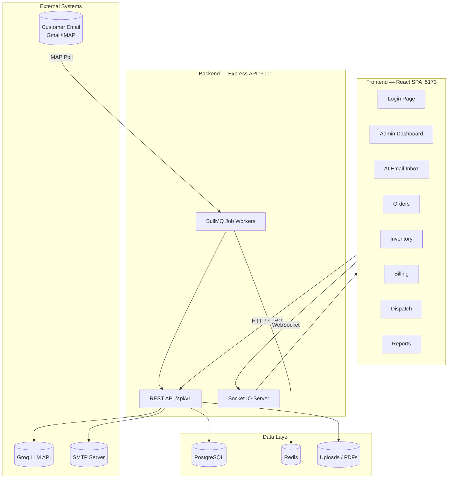
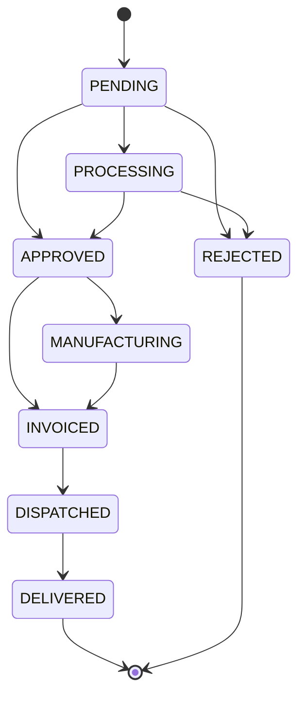
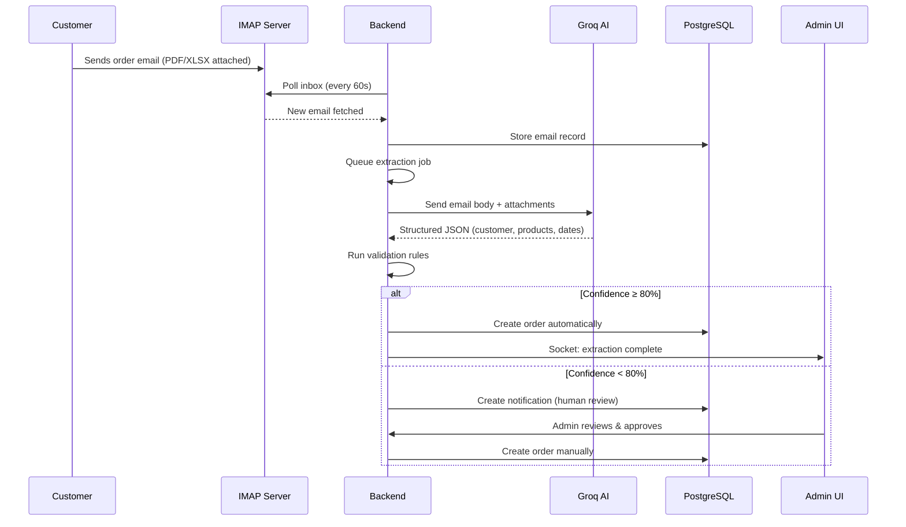
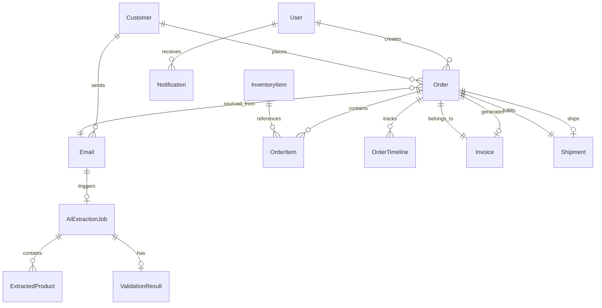
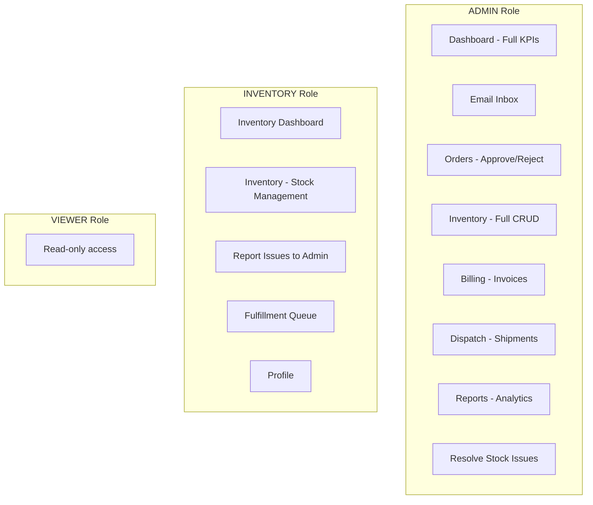
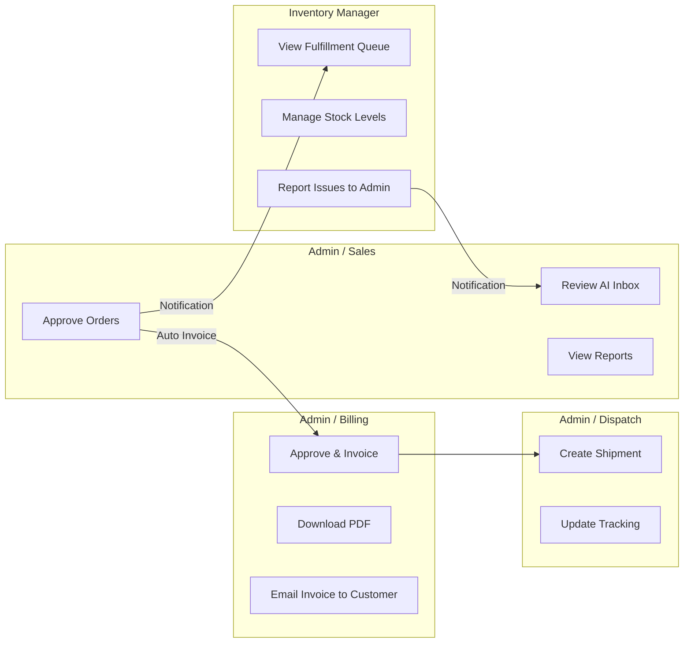

# OrderPilot AI — Project Report
## Automated Order Entry System for SMBs

**Document Version:** 1.0  
**Date:** July 25, 2026  
**Project Name:** OrderPilot AI (Eaton Workspace)  
**Purpose:** Evaluate how the built application addresses the problem statement of automating manual email-based order entry for small and medium businesses.

---

## Table of Contents

1. [Problem Statement (Original)](#1-problem-statement-original)
2. [Executive Summary](#2-executive-summary)
3. [Problem Statement vs. Solution Mapping](#3-problem-statement-vs-solution-mapping)
4. [Technology Stack](#4-technology-stack)
5. [System Architecture](#5-system-architecture)
6. [End-to-End Order Flow](#6-end-to-end-order-flow)
7. [Backend Modules & API Reference](#7-backend-modules--api-reference)
8. [Frontend Pages — Complete Guide](#8-frontend-pages--complete-guide)
9. [Database Design](#9-database-design)
10. [Role-Based Access Control](#10-role-based-access-control)
11. [Automation & AI Features](#11-automation--ai-features)
12. [Team Coordination Features](#12-team-coordination-features)
13. [Gap Analysis & Recommended Improvements](#13-gap-analysis--recommended-improvements)
14. [How to Run the Application](#14-how-to-run-the-application)
15. [Conclusion](#15-conclusion)

---

## 1. Problem Statement (Original)

> In many small and medium businesses, customer orders are still captured manually through emails with spreadsheets and PDFs attached. Orders are created through manual processes based on the information received in the email. These manual processes are time-consuming, error-prone, and difficult to scale. Common problems include:
>
> - Incorrect order details  
> - Delayed order confirmation  
> - Lack of order tracking  
> - Poor coordination between sales, inventory, and billing teams  
>
> **Objective:** Design and develop an **Automated Order Entry System** using information received in email, that places orders digitally and enables the system to automatically validate, store, and process orders with minimal manual intervention.

---

## 2. Executive Summary

**OrderPilot AI** is a full-stack enterprise order management platform built to digitize the email-to-order pipeline for SMBs. The system:

| Capability | Status |
|---|---|
| Ingest orders from email (IMAP polling) | ✅ Implemented |
| Parse email body + PDF + Excel attachments | ✅ Implemented |
| AI-powered data extraction (Groq LLM) | ✅ Implemented |
| Automated validation rules | ✅ Implemented |
| Auto-create orders (high confidence) | ✅ Implemented |
| Human review for low-confidence extractions | ✅ Implemented |
| Order lifecycle tracking (8-step timeline) | ✅ Implemented |
| Inventory coordination | ✅ Implemented |
| Billing & invoice generation | ✅ Implemented |
| Dispatch & shipment tracking | ✅ Implemented |
| Real-time notifications & dashboards | ✅ Implemented |
| Role-based team coordination | ✅ Implemented |

**Overall verdict:** The application **substantially addresses** the problem statement. It covers the full order lifecycle from email ingestion to dispatch, with AI automation, validation, and multi-team coordination. Some gaps remain (detailed in Section 13) around customer-facing order confirmation emails, attachment parsing completeness, and production hardening.

---

## 3. Problem Statement vs. Solution Mapping

| Problem | How OrderPilot AI Addresses It | Where in the App |
|---|---|---|
| Manual email reading | IMAP inbox polling every ~60s ingests new emails automatically | Backend: `emailIngestion.job.ts` |
| Spreadsheet/PDF parsing | AI extracts products from email body, PDF (`pdf-parse`), Excel/CSV (`xlsx`) | Backend: `extraction.service.ts`, `groq.client.ts` |
| Manual order creation | Auto-creates order when AI confidence ≥ 80%; manual approve otherwise | `/inbox/:id`, `/orders/:id` |
| Incorrect order details | Validation engine checks SKU, duplicates, quantities, delivery dates | Backend: `validation.service.ts` |
| Delayed order confirmation | Real-time Socket.IO events + notifications on order creation | Dashboard, TopHeader notifications |
| Lack of order tracking | 8-step timeline on every order; status state machine | `/orders/:id` |
| Poor sales–inventory–billing coordination | Role-based dashboards, notifications, shared order state | Admin Dashboard, Inventory Dashboard, Billing |
| Time-consuming processes | BullMQ background jobs for extraction, validation, invoicing | Backend job queues |
| Error-prone manual entry | Structured JSON extraction + Zod validation + business rules | Throughout backend |
| Difficult to scale | PostgreSQL + Redis queues + stateless API | Architecture |

---

## 4. Technology Stack

### 4.1 Frontend (`OrderPilotAI/`)

| Layer | Technology | Version | Purpose |
|---|---|---|---|
| Framework | React | 19.x | UI components |
| Build Tool | Vite | 8.x | Dev server & bundling |
| Language | TypeScript | 6.x | Type safety |
| Routing | React Router DOM | 7.x | SPA navigation |
| State (server) | TanStack React Query | 5.x | API caching & mutations |
| State (client) | Zustand | 5.x | Auth session store |
| Animation | Framer Motion | 12.x | Page transitions |
| Icons | Lucide React | 1.x | UI icons |
| Styling | Custom CSS (`globals.css`) | — | Dark enterprise theme |

**Dev URL:** `http://localhost:5173` (Vite default)

### 4.2 Backend (`backend/`)

| Layer | Technology | Version | Purpose |
|---|---|---|---|
| Runtime | Node.js | ≥ 20 | Server runtime |
| Framework | Express.js | 4.x | REST API |
| Language | TypeScript | 5.x | Type safety |
| ORM | Prisma | 5.x | Database access |
| Database | PostgreSQL | — | Persistent storage |
| Cache/Queue | Redis + BullMQ | 5.x / 5.x | Background jobs |
| AI/LLM | Groq SDK | 0.9.x | Order data extraction |
| Email In | IMAPFlow + Mailparser | — | Inbox polling & parsing |
| Email Out | Nodemailer | 6.x | Invoice & notification emails |
| PDF Read | pdf-parse | — | Extract text from PDF attachments |
| PDF Write | PDFKit | — | Generate invoice PDFs |
| Spreadsheets | xlsx | — | Parse Excel/CSV attachments |
| Real-time | Socket.IO | 4.x | Live dashboard updates |
| Auth | JWT + bcryptjs | — | Login & role authorization |
| Validation | Zod | 3.x | Request & env validation |
| Security | Helmet, CORS, Rate Limiting | — | API hardening |
| Logging | Winston + Morgan | — | Structured logs |

**API URL:** `http://localhost:3001/api/v1`  
**Health Check:** `http://localhost:3001/health`

### 4.3 Infrastructure & DevOps

| Component | Details |
|---|---|
| File Storage | Local `/uploads` (invoices PDFs) |
| Job Workers | BullMQ workers (extraction, email ingestion, invoice sender) |
| DB Migrations | Prisma Migrate |
| Seed Data | `backend/prisma/seed.ts` |
| Testing | Jest + Supertest (backend) |

---

## 5. System Architecture



### 5.1 Folder Structure

```
Eaton/
├── OrderPilotAI/          # React frontend
│   └── src/
│       ├── pages/         # 12 page components
│       ├── components/    # Layout (Sidebar, TopHeader, BottomNav)
│       ├── lib/api.ts     # Centralized API client
│       ├── store/         # Zustand auth store
│       └── styles/        # Global CSS
│
└── backend/               # Express backend
    └── src/
        ├── modules/       # Feature modules (13 domains)
        ├── jobs/          # Background workers
        ├── middleware/    # Auth, errors, rate limit
        ├── config/        # Env, DB, AI, logger
        ├── sockets/       # Real-time events
        └── shared/        # Constants, utils, errors
```

---

## 6. End-to-End Order Flow

### 6.1 Master Pipeline

```mermaid
flowchart LR
    A["📧 Email Received<br/>(IMAP Ingestion)"] --> B["🤖 AI Extraction<br/>(Groq LLM)"]
    B --> C{"Confidence<br/>≥ 80%?"}
    C -->|Yes| D["✅ Auto-Create Order"]
    C -->|No| E["👀 Human Review<br/>Email Detail Page"]
    E --> F["Manual Approve"]
    F --> D
    D --> G["🔍 Validation<br/>(SKU, qty, dates)"]
    G --> H["📋 Order PENDING/PROCESSING"]
    H --> I["✔ Admin Approves Order"]
    I --> J["📦 Notify Inventory Team"]
    I --> K["🧾 Auto-Generate Invoice"]
    K --> L["📧 Email Invoice to Customer"]
    J --> M["📦 Inventory Fulfillment"]
    M --> N["🏭 Manufacturing (optional)"]
    N --> O["🚚 Dispatch Shipment"]
    O --> P["✅ Delivered"]
```



### 6.2 Order Status State Machine



**Progress mapping:** PENDING (10%) → PROCESSING (25%) → APPROVED (45%) → MANUFACTURING (62%) → INVOICED (80%) → DISPATCHED (95%) → DELIVERED (100%)

### 6.3 Email-to-Order Sequence Diagram



---

## 7. Backend Modules & API Reference

All routes prefixed with `/api/v1`.

| Module | Base Route | Key Endpoints | Purpose |
|---|---|---|---|
| **Auth** | `/auth` | `POST /login`, `POST /refresh`, `POST /logout` | JWT authentication |
| **Emails** | `/emails` | `GET /`, `GET /:id`, `PATCH /:id/read` | Email inbox management |
| **Extraction** | `/extraction` | `POST /:jobId/approve`, `GET /:jobId` | AI extraction jobs |
| **Validation** | `/validation` | `GET /:jobId`, `POST /:jobId/run` | Order validation reports |
| **Orders** | `/orders` | `GET /`, `GET /:id`, `POST /`, `PATCH /:id/status` | Order CRUD & lifecycle |
| **Customers** | `/customers` | `GET /`, `GET /:id`, `POST /` | Customer master data |
| **Inventory** | `/inventory` | `GET /`, `POST /`, `PATCH /:id`, `POST /:id/report-issue` | Stock management |
| **Manufacturing** | `/manufacturing` | `GET /jobs`, `POST /jobs` | Production jobs |
| **Billing** | `/billing` | `GET /invoices`, `POST /invoices`, `GET /invoices/:id/pdf`, `POST /invoices/:id/send` | Invoicing |
| **Dispatch** | `/dispatch` | `GET /shipments`, `POST /shipments`, `PATCH /shipments/:id/status` | Shipping |
| **Notifications** | `/notifications` | `GET /`, `POST /`, `PATCH /:id/resolve` | Alerts & issue reports |
| **Dashboard** | `/dashboard` | `GET /kpis`, `GET /recent-orders`, `GET /ai-activity` | Admin KPIs |
| **Reports** | `/reports` | `GET /summary`, `GET /revenue` | Analytics |
| **AI Assistant** | `/ai-assistant` | `POST /chat` | Natural language DB queries |

### 7.1 Background Jobs

| Job | Trigger | Function |
|---|---|---|
| `emailIngestion.job` | Recurring (IMAP poll interval) | Fetch new emails from inbox |
| `extraction.job` | On new email | AI extract + validate + auto-order |
| `invoiceSender.job` | On demand | Email invoice PDF to customer |

---

## 8. Frontend Pages — Complete Guide

**Base URL:** `http://localhost:5173`

### 8.1 Page Index

| # | Page | Route | Roles | Description |
|---|---|---|---|---|
| 1 | Login | `/` (unauthenticated) | All | Authentication entry point |
| 2 | Admin Dashboard | `/dashboard` | ADMIN | KPIs, revenue, stock issues, recent orders |
| 3 | Inventory Dashboard | `/dashboard` | INVENTORY | Inventory manager home (replaces admin dashboard) |
| 4 | AI Email Inbox | `/inbox` | ADMIN | List of ingested customer emails |
| 5 | Email Detail | `/inbox/:id` | ADMIN | View email, AI extraction, approve/reject |
| 6 | Orders | `/orders` | ADMIN | Paginated order list with status filters |
| 7 | Order Detail | `/orders/:id` | ADMIN | Full order view, timeline, approve/reject |
| 8 | Inventory | `/inventory` | ALL | Stock levels, alerts, item management |
| 9 | Billing | `/billing` | ADMIN | Invoices, approve & invoice, PDF download, email |
| 10 | Dispatch | `/dispatch` | ADMIN | Shipments, tracking, delivery status |
| 11 | Reports | `/reports` | ADMIN | Executive analytics & reports |
| 12 | Profile | `/profile` | ALL | User settings & preferences |

---

### 8.2 Page-by-Page Detail

#### 1. Login — `http://localhost:5173/`

**File:** `OrderPilotAI/src/pages/Login.tsx`

| Feature | Details |
|---|---|
| Email/password login | JWT token stored in localStorage |
| Quick-fill presets | Admin & Inventory demo accounts |
| Demo credentials | Admin: `admin@orderpilot.ai` / `Admin@123` |
| | Inventory: `inventory@orderpilot.ai` / `Inventory@123` |

---

#### 2. Admin Dashboard — `http://localhost:5173/dashboard`

**File:** `OrderPilotAI/src/pages/Dashboard.tsx`  
**Role:** ADMIN only (Inventory users redirected to Inventory Dashboard)

| Section | What It Shows |
|---|---|
| KPI Cards | Total orders, revenue, pending approvals, AI accuracy |
| Revenue Chart | 30-day revenue trend (SVG line chart) |
| AI Activity Feed | Recent extraction events |
| Recent Orders | Latest orders with status badges |
| Stock Issues Panel | Inventory reports flagged by inventory manager (manual + stock concerns) |
| Resolve Actions | Admin can mark stock issues as resolved |

**APIs used:** `/dashboard/kpis`, `/dashboard/recent-orders`, `/dashboard/ai-activity`, `/notifications`

---

#### 3. Inventory Manager Dashboard — `http://localhost:5173/dashboard` (INVENTORY role)

**File:** `OrderPilotAI/src/pages/InventoryDashboard.tsx`  
**Role:** INVENTORY

| Section | What It Shows |
|---|---|
| Stats | Total SKUs, low stock count, critical alerts |
| Alerts Panel | Low/critical stock warnings |
| Fulfillment Queue | Approved orders ready for packing |
| Report Issue Modal | Manual issue reporting to admin (`issueKind: MANUAL`) |
| Quick Actions | Navigate to inventory, report issues |

**APIs used:** `/inventory/stats`, `/inventory/alerts`, `/orders`, `/notifications`

---

#### 4. AI Email Inbox — `http://localhost:5173/inbox`

**File:** `OrderPilotAI/src/pages/AIInbox.tsx`  
**Role:** ADMIN

| Feature | Details |
|---|---|
| Email list | All ingested customer emails |
| Status badges | PENDING, PROCESSING, PROCESSED, FAILED |
| AI confidence indicator | Shows extraction confidence % |
| Search & filter | By status, company, subject |
| Click-through | Opens Email Detail page |

**APIs used:** `/emails`

---

#### 5. Email Detail — `http://localhost:5173/inbox/:id`

**File:** `OrderPilotAI/src/pages/EmailDetail.tsx`  
**Role:** ADMIN

| Feature | Details |
|---|---|
| Email viewer | From, subject, body, received date |
| AI Extraction panel | Customer name, products, delivery date, priority, confidence |
| Validation issues | Errors, warnings from validation engine |
| Approve button | Creates order from extraction job (low-confidence emails) |
| Link to order | If auto-created, links to `/orders/:id` |

**APIs used:** `/emails/:id`, `/extraction/:jobId`, `/extraction/:jobId/approve`

---

#### 6. Orders — `http://localhost:5173/orders`

**File:** `OrderPilotAI/src/pages/Orders.tsx`  
**Role:** ADMIN

| Feature | Details |
|---|---|
| Order table | Order number, customer, amount, status, priority, date |
| Status tabs | All, Pending, Processing, Approved, Manufacturing, Dispatched, Invoiced |
| Search | By order number or customer |
| Pagination | Server-side paginated |
| Click-through | Opens Order Detail |

**APIs used:** `/orders?status=...&search=...`

---

#### 7. Order Detail — `http://localhost:5173/orders/:id`

**File:** `OrderPilotAI/src/pages/OrderDetail.tsx`  
**Role:** ADMIN

| Feature | Details |
|---|---|
| Order header | Order number, customer, amount, priority, status badge |
| 8-step timeline | Email Received → AI Extraction → Validation → Order Created → Inventory → Manufacturing → Invoice → Dispatch |
| Line items | Product name, SKU, quantity, unit price, total |
| Customer info | Company, contact, payment terms |
| Approve/Reject | For PENDING/PROCESSING orders |
| Real-time updates | Socket.IO order status changes |

**APIs used:** `/orders/:id`, `PATCH /orders/:id/status`

---

#### 8. Inventory — `http://localhost:5173/inventory`

**File:** `OrderPilotAI/src/pages/Inventory.tsx`  
**Role:** ALL (Admin + Inventory Manager)

| Feature | Details |
|---|---|
| Stock table | SKU, name, available qty, reserved qty, status (Healthy/Low/Critical) |
| Status filters | All, Healthy, Low, Critical |
| Add/Edit items | Create and update inventory records |
| Report Issue (per item) | Report stock concern for specific SKU to admin |
| Warehouse stats | Capacity, utilization metrics |

**APIs used:** `/inventory`, `/inventory/:id/report-issue`

---

#### 9. Billing — `http://localhost:5173/billing`

**File:** `OrderPilotAI/src/pages/Billing.tsx`  
**Role:** ADMIN

| Feature | Details |
|---|---|
| Revenue stats | Outstanding, collected, overdue amounts |
| Pending orders panel | Orders awaiting approval with "Approve & Invoice" button |
| Invoice table | All invoices with status filters (Draft, Sent, Paid, Overdue) |
| Invoice preview | Bill-to, line items, GST calculation |
| PDF download | Authenticated download of invoice PDF |
| Email to customer | Sends invoice PDF via SMTP to customer email |

**APIs used:** `/billing/invoices`, `/orders?status=PENDING`, `PATCH /orders/:id/status`, `POST /billing/invoices/:id/send`

**Automation:** When an order is approved, backend auto-generates invoice PDF and sets order to INVOICED.

---

#### 10. Dispatch — `http://localhost:5173/dispatch`

**File:** `OrderPilotAI/src/pages/Dispatch.tsx`  
**Role:** ADMIN

| Feature | Details |
|---|---|
| Shipment list | All shipments with courier, tracking, status |
| Create shipment | For invoiced orders |
| Status updates | Pending → In Transit → Delivered |
| Map/visual tracking | Shipment route visualization |
| Delivery stats | On-time rate, active shipments |

**APIs used:** `/dispatch/shipments`, `POST /dispatch/shipments`, `PATCH /dispatch/shipments/:id/status`

---

#### 11. Reports — `http://localhost:5173/reports`

**File:** `OrderPilotAI/src/pages/Reports.tsx`  
**Role:** ADMIN

| Feature | Details |
|---|---|
| Executive summary | Orders by status, revenue breakdown |
| Charts | Order funnel, invoice stats |
| Date range filters | Period-based analytics |
| Export-ready data | Summary tables |

**APIs used:** `/reports/summary`, `/reports/revenue`

---

#### 12. Profile — `http://localhost:5173/profile`

**File:** `OrderPilotAI/src/pages/Profile.tsx`  
**Role:** ALL

| Feature | Details |
|---|---|
| User info | Name, email, role, avatar initials |
| Notification toggle | UI preference |
| Theme/settings | Profile customization |

---

## 9. Database Design

**ORM:** Prisma | **Database:** PostgreSQL

### 9.1 Core Models



### 9.2 Key Enums

| Enum | Values |
|---|---|
| UserRole | ADMIN, INVENTORY, VIEWER |
| EmailStatus | PENDING, PROCESSING, PROCESSED, FAILED |
| ExtractionStatus | QUEUED, PROCESSING, COMPLETED, FAILED |
| OrderStatus | PENDING, PROCESSING, APPROVED, MANUFACTURING, INVOICED, DISPATCHED, DELIVERED, REJECTED |
| InventoryStatus | HEALTHY, LOW, CRITICAL |
| InvoiceStatus | DRAFT, SENT, PAID, OVERDUE, CANCELLED |
| ShipmentStatus | PENDING, IN_TRANSIT, DELIVERED, RETURNED |
| NotificationType | ORDER, INVENTORY, AI, DISPATCH, INVOICE |

---

## 10. Role-Based Access Control



| Page / Feature | ADMIN | INVENTORY | VIEWER |
|---|---|---|---|
| Dashboard (Admin KPIs) | ✅ | ❌ (gets Inventory Dashboard) | ❌ |
| Email Inbox | ✅ | ❌ | ❌ |
| Orders | ✅ | ❌ | ❌ |
| Inventory | ✅ | ✅ | ❌ |
| Billing | ✅ | ❌ | ❌ |
| Dispatch | ✅ | ❌ | ❌ |
| Reports | ✅ | ❌ | ❌ |
| Report Issue to Admin | ❌ | ✅ | ❌ |
| Approve Orders | ✅ | ❌ | ❌ |

---

## 11. Automation & AI Features

### 11.1 AI Extraction Pipeline

1. **Input sources:** Email body (HTML/plain text), PDF attachments, Excel/CSV/ODS spreadsheets
2. **AI model:** Groq LLM (via `groq-sdk`)
3. **Extracted fields:** Customer name, delivery date, priority, products (name, SKU, qty, price), summary, confidence score
4. **Auto-approve threshold:** Confidence ≥ 80% → order created automatically
5. **Human review:** Confidence < 80% → admin notified, manual approval required

### 11.2 Validation Rules

| Check | Type | Description |
|---|---|---|
| Customer exists | Error/Warning | Match email to customer record |
| SKU in inventory | Warning | Unknown SKU flagged |
| Duplicate order | Warning | Same customer + products within 7 days |
| Quantity sanity | Warning | Quantities > 50,000 flagged |
| Delivery lead time | Warning | Less than 2 business days |
| Price validation | Info | Zero or missing prices flagged |

### 11.3 Automated Actions

| Trigger | Automated Action |
|---|---|
| New email ingested | Queue AI extraction job |
| Extraction confidence ≥ 80% | Auto-create order + notification |
| Extraction confidence < 80% | Notify admin for human review |
| Order approved | Notify inventory team + auto-generate invoice |
| Invoice generated | PDF stored, order status → INVOICED |
| Low stock detected | Inventory status updated + alerts |
| Inventory manager reports issue | Notification sent to all admins |

---

## 12. Team Coordination Features



| Coordination Mechanism | Description |
|---|---|
| **Notifications** | In-app alerts for all teams (TopHeader bell icon) |
| **Role dashboards** | Each role sees relevant data only |
| **Shared order state** | Single source of truth in PostgreSQL |
| **Real-time updates** | Socket.IO pushes status changes live |
| **Issue reporting** | Inventory → Admin escalation workflow |
| **Order timeline** | 8-step visual progress visible to all admins |

---

## 13. Gap Analysis & Recommended Improvements

> ⚠️ **Note:** These are recommendations only. No changes have been made to the application.

### 13.1 What Is Well Covered ✅

- Email ingestion and AI extraction
- Multi-format attachment parsing (PDF, Excel)
- Validation with business rules
- Full order lifecycle with state machine
- Inventory management and alerts
- Invoice generation and email
- Dispatch tracking
- Multi-role coordination
- Real-time notifications

### 13.2 Gaps & Recommended Additions

| # | Gap | Impact | Recommendation | Priority |
|---|---|---|---|---|
| 1 | **No automatic order confirmation email to customer** | Customer doesn't receive acknowledgment when order is created | Send templated confirmation email on order creation/approval with order number and summary | HIGH |
| 2 | **IMAP attachment saving incomplete** | `hasAttachments: false` hardcoded in ingestion; attachments may not always be stored | Fully persist and link email attachments before extraction | HIGH |
| 3 | **No customer portal** | Customers cannot track their own orders | Add read-only customer portal or status page link in confirmation email | MEDIUM |
| 4 | **SMTP required for outbound email** | Invoice/notification emails fail silently if SMTP not configured | Add clear UI indicator when SMTP is disabled; queue emails for retry | MEDIUM |
| 5 | **No OCR for scanned PDFs/image orders** | Handwritten or image-only PDFs won't extract | Integrate OCR (Tesseract/Google Vision) as pre-processing step | MEDIUM |
| 6 | **Single email provider (IMAP only)** | No Microsoft Graph / Gmail API / webhook support | Add OAuth-based email integrations for enterprise customers | MEDIUM |
| 7 | **No duplicate email thread handling** | Reply chains may create duplicate orders | Thread detection via `In-Reply-To` / `References` headers | MEDIUM |
| 8 | **Manufacturing step often skipped** | Invoice auto-generation on approve bypasses manufacturing | Make manufacturing optional/configurable per order type | LOW |
| 9 | **No audit log UI** | Cannot see who changed what and when | Add activity/audit log page for compliance | LOW |
| 10 | **Reports use some static/mock chart data** | Billing revenue chart on Billing page uses placeholder data | Wire all charts to live `/reports` API data | LOW |
| 11 | **No mobile app / PWA** | Field staff can't access on mobile easily | Add PWA manifest or responsive improvements | LOW |
| 12 | **VIEWER role underutilized** | VIEWER role defined but limited read-only pages | Implement read-only views for VIEWER across orders/inventory | LOW |
| 13 | **No multi-warehouse support** | Single inventory pool assumed | Add warehouse/location dimension to inventory | LOW |
| 14 | **No payment gateway integration** | Invoices tracked but payments manual | Integrate Razorpay/Stripe for online payment links in invoices | LOW |
| 15 | **No SLA/deadline alerts** | Delivery date breaches not proactively alerted | Add cron job to flag overdue orders before delivery date | MEDIUM |

### 13.3 Problem Statement Coverage Score

| Requirement | Coverage | Score |
|---|---|---|
| Capture orders from email | ✅ Full | 95% |
| Parse spreadsheets & PDFs | ✅ Mostly (needs OCR for scans) | 80% |
| Digital order placement | ✅ Full | 95% |
| Automatic validation | ✅ Full | 90% |
| Store orders | ✅ Full | 100% |
| Process orders (lifecycle) | ✅ Full | 90% |
| Minimal manual intervention | ✅ High-confidence auto-flow | 85% |
| Reduce incorrect details | ✅ Validation + human review | 85% |
| Order confirmation | ⚠️ Internal only, not customer-facing | 50% |
| Order tracking | ✅ Admin-side full tracking | 80% |
| Sales–Inventory–Billing coordination | ✅ Notifications + roles | 90% |

**Overall alignment with problem statement: ~87%**

---

## 14. How to Run the Application

### Prerequisites
- Node.js ≥ 20
- PostgreSQL running
- Redis running (for background jobs)
- `.env` configured in `backend/` (DATABASE_URL, JWT secrets, Groq API key, optional IMAP/SMTP)

### Start Backend
```bash
cd backend
npm install
npx prisma migrate dev
npm run db:seed
npm run dev
# Runs on http://localhost:3001
```

### Start Frontend
```bash
cd OrderPilotAI
npm install
npm run dev
# Runs on http://localhost:5173
```

### Demo Login
| Role | Email | Password |
|---|---|---|
| Admin | admin@orderpilot.ai | Admin@123 |
| Inventory Manager | inventory@orderpilot.ai | Inventory@123 |

### Quick Navigation Links (when running locally)

| Page | URL |
|---|---|
| Login | http://localhost:5173/ |
| Admin Dashboard | http://localhost:5173/dashboard |
| AI Email Inbox | http://localhost:5173/inbox |
| Orders | http://localhost:5173/orders |
| Inventory | http://localhost:5173/inventory |
| Billing | http://localhost:5173/billing |
| Dispatch | http://localhost:5173/dispatch |
| Reports | http://localhost:5173/reports |
| Profile | http://localhost:5173/profile |
| API Health | http://localhost:3001/health |
| API Base | http://localhost:3001/api/v1 |

---

## 15. Conclusion

**OrderPilot AI** is a comprehensive Automated Order Entry System that directly addresses the core pain points described in the problem statement:

1. **Eliminates manual email reading** through IMAP ingestion and AI extraction
2. **Handles spreadsheets and PDFs** via multi-format parsing pipeline
3. **Reduces errors** through validation rules and confidence-based human review
4. **Enables order tracking** via an 8-step timeline and status state machine
5. **Coordinates teams** through role-based access, notifications, and dedicated dashboards for Admin, Inventory, and Billing workflows
6. **Scales beyond manual processes** with background job queues, structured data storage, and real-time updates

The system is production-ready for a demo/MVP stage. To fully satisfy the problem statement in a live SMB deployment, the highest-priority additions would be **customer-facing order confirmation emails**, **complete attachment persistence**, and **customer order tracking visibility**.

---

*Report generated for the Eaton / OrderPilot AI project. No application code was modified during this analysis.*
