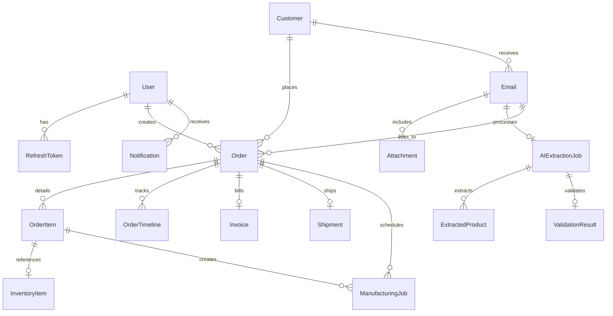

# OrderPilot AI — Platform Functionalities and Implementation Details

OrderPilot AI is a premium, enterprise-grade **Order Management System (OMS)** designed to automate the ingestion of incoming Purchase Orders (POs) via email, parse them using state-of-the-art Large Language Models (LLMs), validate the extracted details against inventory and customer records, manage manufacturing/production jobs, compile and email invoices, and track logistics through dispatch and delivery.

---

## 🛠️ Technology Stack & Architecture

### 1. Frontend (Single Page Application)
- **Framework & Language**: React 19 (TypeScript), built with Vite 8.
- **Styling**: Premium Design System with custom CSS variables (dark-mode native, noise texturing, card glassmorphism, responsive viewport alignment).
- **State Management**: `zustand` handles client-side caching of session/auth states, cart additions, UI toggles, and notification tallies.
- **Server Cache Sync**: `@tanstack/react-query` handles caching, retry heuristics, and synchronizing with the backend REST endpoints.
- **Animations**: `framer-motion` triggers micro-animations, slide-ins, and layout transitions.
- **Icons**: `lucide-react` provides unified iconography.

### 2. Backend (REST API & Real-time WebSockets)
- **Runtime**: Node.js with Express and TypeScript.
- **ORM & Database**: Prisma ORM client connected to PostgreSQL.
- **Real-time Server-to-Client**: Socket.IO broadcasts instant status alerts (e.g., low stock warnings, new POs ingested, extraction failures).
- **Background Worker Queues**: BullMQ running on Redis manages high-volume queues:
  - `aiExtraction`: Parses email bodies and PDF attachments.
  - `emailIngestion`: Polls and connects to customer mailboxes via IMAP.
  - `invoiceSender`: Generates PDFs and sends emails out via SMTP.
  - `stockAlert`: Checks inventory thresholds and logs notifications.
- **AI Processing**: Groq Cloud SDK with `llama-3.3-70b-versatile` (advanced structural extraction) and `llama-3.2-11b-vision-preview` (multimodal PDF extraction).
- **Email Delivery**: Nodemailer connects to SMTP channels to email PDF invoices directly to clients.

---

## 🗄️ Database Schema & Models

The PostgreSQL database mapped via Prisma models spans the entire order lifecycle:



### Primary Models:
1. **User**: Management accounts with designated permissions (`ADMIN`, `OPERATOR`, `VIEWER`).
2. **Customer**: Holds client profiles, company names, contact numbers, email domains, payment terms, and custom notes.
3. **Email & Attachment**: Ingests incoming communications, saves files to `/uploads`, and tracks processing statuses (`PENDING`, `PROCESSING`, `PROCESSED`, `FAILED`).
4. **AIExtractionJob**: Logs LLM metadata, summary briefs, confidence ratios, parsed delivery dates, and raw response payloads.
5. **ExtractedProduct**: Tracks line items extracted by AI, including SKU numbers, quantities, prices, and prediction confidence.
6. **ValidationResult**: Runs matching logic to highlight errors (e.g., unrecognized customer, SKU mismatches, pricing discrepancies).
7. **Order & OrderItem**: Central registry of approved transactions with progressive statuses (`PENDING` ➔ `PROCESSING` ➔ `APPROVED` ➔ `MANUFACTURING` ➔ `INVOICED` ➔ `DISPATCHED` ➔ `DELIVERED`).
8. **OrderTimeline**: Linear tracking of order phase transitions with custom timestamps.
9. **InventoryItem**: Tracks stock levels (`totalQty`, `availableQty`, `reservedQty`) and flags stock health (`HEALTHY`, `LOW`, `CRITICAL`).
10. **ManufacturingJob**: Triggered automatically when an approved order item suffers from insufficient stock.
11. **Invoice**: Holds financial totals, 18% GST (tax amount), due dates, and PDF storage directories.
12. **Shipment**: Stores logistic handlers, air waybill (AWB) numbers, and dispatch dates.
13. **Notification**: Instantly records system logs for critical triggers.

---

## ⚡ Functional Modules & System Workflows

### 1. Secure Authentication & Session Guard
- Operators log in using email credentials.
- Backend yields dual-token authorization (a short-lived JWT Access Token and a long-lived database-verified Refresh Token stored securely).
- Page-level guards filter viewer/operator permissions.

### 2. AI-Powered Email Inbox & PO Parsing
- The backend IMAP worker checks incoming mailboxes, saves attachments (PDFs/Images), and feeds the document/email text to Groq's Llama 3 models.
- The LLM extracts the buyer's details, order number, and list of line items.
- The frontend **AI Inbox** displays the parsed email, provides direct previews of PDF attachments, and lists extracted fields side-by-side with confidence scores.

### 3. Automated Order Validation Engine
- Before converting an extraction into an official order, the system compares:
  - **SKU Validation**: Compares extracted SKUs against the inventory database.
  - **Price Validation**: Flags if the customer's request price deviates from the standard price list.
  - **Customer Matching**: Matches the sender's email domain with existing customer directories.
- Any discrepancy is flagged as an `issue` (e.g., `SKU_NOT_FOUND`, `PRICE_MISMATCH`) for the operator to approve or override.

### 4. Interactive Order Lifecycle & Timeline
- Once an operator approves a validated draft, it is promoted to an official `Order`.
- The system allocates a custom serial (e.g., `OP-2026-0001`).
- Dynamic interactive steps let the operator transition the order through production, invoicing, and dispatch, logging history in `OrderTimeline`.

### 5. Smart Inventory & Manufacturing Pipeline
- Approving an order immediately shifts the needed quantities from `availableQty` to `reservedQty` in the `InventoryItem` registry.
- If there is insufficient stock:
  - The order status switches to `MANUFACTURING`.
  - A `ManufacturingJob` is queued for production with target completion dates.
  - When production finishes, inventory increases, and the order advances.
- A recurring worker scans inventory, flagging stock that dips below the `reorderLevel` as `LOW` or `CRITICAL`.

### 6. Billing, PDF Generation & SMTP Mailing
- When an order enters the `INVOICED` state, the backend uses `pdfkit` to compile a professional, clean tax invoice PDF.
- The PDF calculates sub-totals, adds 18% tax (standard GST), lists payment terms, and logs it in the `Invoice` schema.
- The system triggers an SMTP node to email the customer their invoice attachment directly.

### 7. Dispatch, Tracking & Logistics
- Handles courier assignments (e.g., Blue Dart, DHL), records AWB tracking numbers, and updates the customer's shipping address.
- Transitioning to `DISPATCHED` or `DELIVERED` automatically increments progress bars and updates the Socket.IO notifications feed.

---

## 🚀 Running the Services Locally

### Prerequisites
- Node.js (v20+)
- PostgreSQL Database
- Redis Server (Optional, required for background queues)

### 1. Database Setup
Configure database connection strings in `backend/.env` and execute:
```bash
cd backend
npx prisma migrate dev
npm run db:seed
```

### 2. Starting the Backend Dev Server
```bash
cd backend
npm run dev
```
*App launches on `http://localhost:3001` with API routes bound to `/api/v1`.*

### 3. Starting the Frontend Client
```bash
cd OrderPilotAI
npm run dev
```
*App launches on `http://localhost:5173`.*
